# **cg-resources**

A collection of links to images, videos, demos, and tools appropriate for use in 3D computer graphics lectures.

## Shadow Techniques

### Cascaded Shadow Maps

[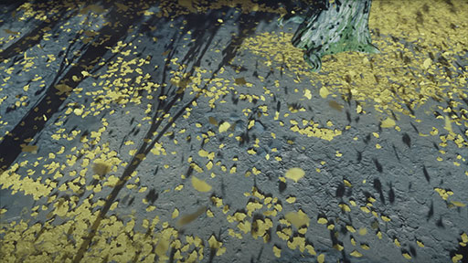](https://youtu.be/X2sOQjSf-LI?t=403)
  [Ghost of Tsushima: The Digital Foundry Tech Review](https://youtu.be/X2sOQjSf-LI) | 2020 -- *Digital Foundry*

### Shadow Map Caching

[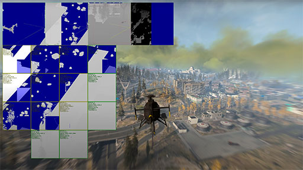](https://youtu.be/mvdTtl27TpM?t=901)
[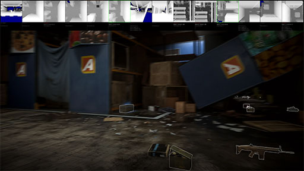](https://youtu.be/mvdTtl27TpM?t=1004)
  [Inside Call of Duty Warzone: Exclusive Tech Deep Dive / Behind The Scenes](https://youtu.be/mvdTtl27TpM) | 2020 -- *Digital Foundry* 

### Screen-Space Shadows

[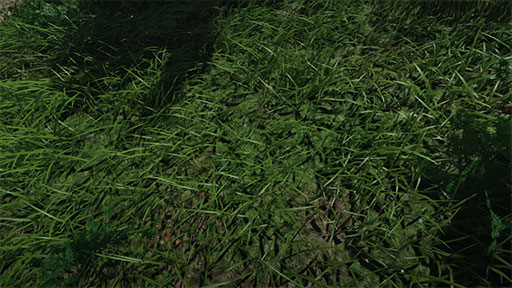](https://youtu.be/X2sOQjSf-LI?t=403)
  [Ghost of Tsushima: The Digital Foundry Tech Review](https://youtu.be/X2sOQjSf-LI) | 2020 -- *Digital Foundry*

### Wavelet Compression

[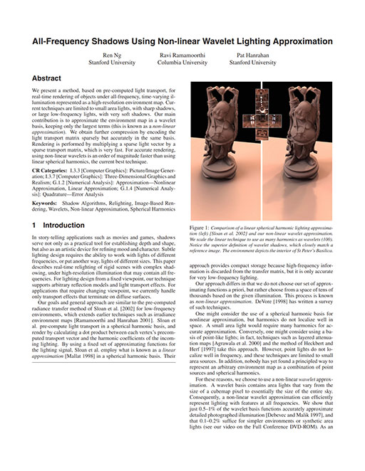](https://cseweb.ucsd.edu/~ravir/papers/allfreq/allfreq.pdf)
  [All-Frequency Shadows Using Non-linear Wavelet Lighting Approximation](https://cseweb.ucsd.edu/~ravir/papers/allfreq/allfreq.pdf) | 2003 -- R. Ng, R. Ramamoorthi, and P. Hanrahan

## Environment Rendering

### Cloud Rendering

[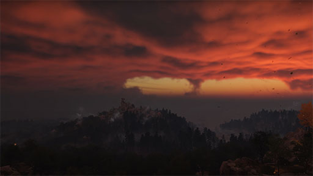](https://youtu.be/X2sOQjSf-LI?t=304)
  [Ghost of Tsushima: The Digital Foundry Tech Review](https://youtu.be/X2sOQjSf-LI) | 2020 -- *Digital Foundry*

### GPU Particles

[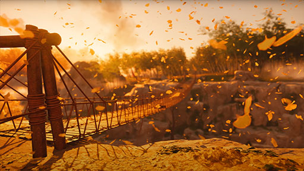](https://youtu.be/X2sOQjSf-LI?t=448)
  [Ghost of Tsushima: The Digital Foundry Tech Review](https://youtu.be/X2sOQjSf-LI) | 2020 -- *Digital Foundry*

## Rendering Optimization

### Dynamic Asset Loading

[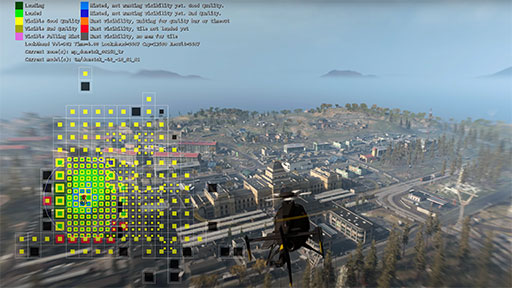](https://youtu.be/mvdTtl27TpM?t=555)
  [Inside Call of Duty Warzone: Exclusive Tech Deep Dive / Behind The Scenes](https://youtu.be/mvdTtl27TpM) | 2020 -- *Digital Foundry* 

### LOD | Level-of-Detail

[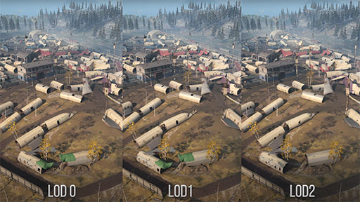](https://youtu.be/mvdTtl27TpM?t=662)
[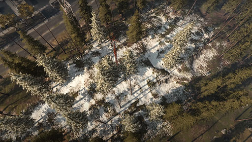](https://youtu.be/mvdTtl27TpM?t=741)
  [Inside Call of Duty Warzone: Exclusive Tech Deep Dive / Behind The Scenes](https://youtu.be/mvdTtl27TpM) | 2020 -- *Digital Foundry* 

## Advanced Computergraphics

### L2 Cache

[Optimizing Compute Shaders for L2 Locality using Thread-Group ID Swizzling](https://developer.nvidia.com/blog/optimizing-compute-shaders-for-l2-locality-using-thread-group-id-swizzling/) | 2020 -- *Louis Bavoil*

## Real-Time Ray/Path Tracing

### Volume Rendering

[Volume Rendering with WebGL](https://www.willusher.io/webgl/2019/01/13/volume-rendering-with-webgl) | 2019 -- *Will Usher*

### Denoising

[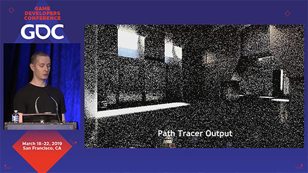](https://youtu.be/FewqoJjHR0A?t=656)
  [Real Time Path Tracing and Denoising in Quake II RTX](https://www.youtube.com/watch?v=FewqoJjHR0A) | 2019 -- *NvidiaGameWorks*

